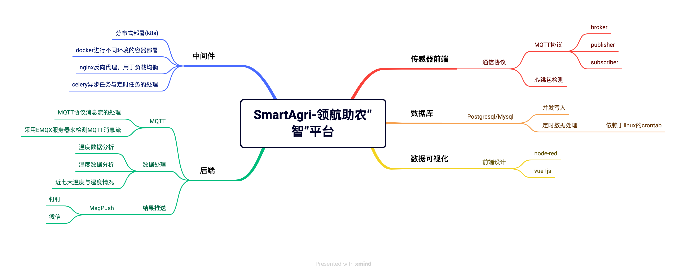

## 计算机设计大赛-物联网组别
### Topic: "SmartAgri-领航助农“智”平台"

### 一、本项目的架构图如下：

### 二、项目实现
**项目实现大致思路如下：**

1.数据采集：采用代码实现MQTT传感器端的数据采集，并将采集到的数据处理成jsonStr的格式上传到server端

2.数据写入：Server端通过端口监听进行数据监测，如果接收到Client端上传的数据,则进行异步操作，将jsonStr数据解析之后写入数据库中  

3.数据处理：通过封装好的函数定时调用，分析处理数据库中的数据，分析大棚中对应植物区的温度及其湿度，与给定的最佳温度湿度进行比对，再进行信息回传上报  

4.数据可视化：通过Node-red订阅MQTT的信息服务器（EMQX）再通过自己编写的前端对接收到的数据进行处理，并显示在web平台上，将数据进行可视化  

5.方便部署及集群化部署：通过使用Docker容器技术以及K8s集群化部署来实现快速的部署。

### 三、项目安装与使用

### 3.1 最低环境要求
CPU:E5 虚拟化双核

内存：2GB

硬盘：20GB(Linux)/40GB(Windows)

网络：2Mbps

系统：Ubuntu18.04+

软件环境:Python3.8+、Nginx、Redis

### 3.2 目录结构
具体代码详见附件中的代码包，以下仅给出二级目录说明。

|—Docs # 存放设计文档

|—src—Fronted # 存放前端代码

|—app.py # flask 后端程序

|—backend.py # 传感器后端程序

|—Common.py # 通用类

|—config.py # 配置文件

|—Dbconn.py # 数据库驱动程序

|—fronted.py # 传感器前端节点程序

|—GetData.py # 数据库驱动程序的封装

|—init.sh # 数据库建设脚本

|—README.md # 项目手册

### 3.3 快速入门
4.3.1 安装依赖
进入源码包目录，执行命令
python3 -m pip update
Python3 -m pip install -r requirements.txt
4.3.2 修改配置
打开配置文件 config.py
■ 配置 mysql：
host: 设为数据库服务器的 IP 地址，通常设为 localhost
port:设为提供数据库服务的端口号，通常为 3306
username: 设为数据库的登录账户
password:设为登录密码
■ 配置 redis：
db1：设为 1
db2：设为 2
host:设为 Redis 的 IP 地址，通常设为 localhost
port:设为提供 redis 服务的端口号，通常为 6379
■ 配置 EMQ X
ip:设为 EMQ X 服务器的 IP 地址，通常为 127.0.0.1
port:设为提供 EMQ X 服务的端口号，通常为 1883
■ 配置消息推送的 sendkey
Sendkey：设为推送手机的的 sendkey
4.3.3 启动数据库
启动本机的 MySQL 数据库
4.3.4 启动前端
进入前端目录，打开终端，输入 npm run serve
4.3.5 启动后端
进入 src 目录，打开终端，输入 python3 app.py
4.3.6 启动 EMQ X 服务器
本机打开终端，输入 emqx start
4.3.7 启动传感器前端
进入 src 目录，打开终端，输入 python3 fronted.py
4.3.8 启动传感器后端
进入 src 目录，打开终端，输入 python3 backend.py
